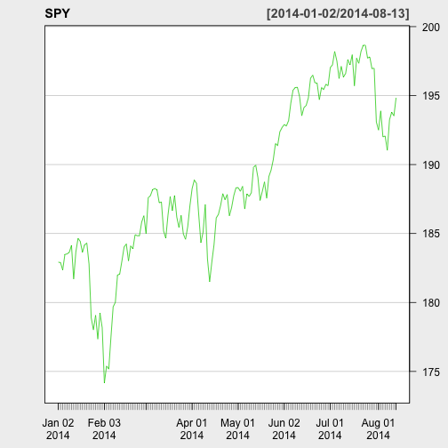

    
## Introduction
    
This application is using Rob Hyndman's BATS forecasting model
and trying to forecast the stock price 3 days in future.

Stock price is a typical **Time Series** data. BATS model is exploiting
the complex seasonal patterns in the data with exponential smoothing and
performing the forecast. In case you are interested, you could reference
this journal.

[Forecasting time series with complex seasonal patterns using exponential smoothing](http://robjhyndman.com/papers/ComplexSeasonality.pdf)

### Anything more interesting than looking into the future?

Visit the application online here now at:

### [Stock Forecast](http://mike-chu.shinyapps.io/demo)

---&twocol w1:60% w2:40%

## Data Source

*** =left
This application is using R's **quantmod** package. Users will specify 
the stock symbols and the data range as source for the forecast. We will
download the closing price information from Yahoo finance webpage and
provide a time series chart for data visualization.

As with any data prediction, we should have a good data source that could
show us some patterns for the prediction. User can observe in the chart if
there are any seasonal patterns for the forecast.

*** =right
 

---
    
## Interactive Plot with NVD3.js
    
NVD3 has a very interactive line chart with view finder. You can find selective legend,
mouse-over focus to show data points at top chart and the view finder for time range
at the bottom. It is making the application much more appealing.


<div id = 'chart1' class = 'rChart nvd3'></div>
<script type='text/javascript'>
 $(document).ready(function(){
      drawchart1()
    });
    function drawchart1(){  
      var opts = {
 "dom": "chart1",
"width":    800,
"height":    400,
"x": "Date",
"y": "value",
"group": "variable",
"type": "lineWithFocusChart",
"id": "chart1" 
},
        data = [
 {
 "Date":          16072,
"variable": "ClosingPrice",
"value":         182.92 
},
{
 "Date":          16073,
"variable": "ClosingPrice",
"value":         182.89 
},
{
 "Date":          16076,
"variable": "ClosingPrice",
"value":         182.36 
},
{
 "Date":          16077,
"variable": "ClosingPrice",
"value":         183.48 
},
{
 "Date":          16078,
"variable": "ClosingPrice",
"value":         183.52 
},
{
 "Date":          16079,
"variable": "ClosingPrice",
"value":         183.64 
},
{
 "Date":          16080,
"variable": "ClosingPrice",
"value":         184.14 
},
{
 "Date":          16083,
"variable": "ClosingPrice",
"value":         181.69 
},
{
 "Date":          16084,
"variable": "ClosingPrice",
"value":         183.67 
},
{
 "Date":          16085,
"variable": "ClosingPrice",
"value":         184.66 
},
{
 "Date":          16086,
"variable": "ClosingPrice",
"value":         184.42 
},
{
 "Date":          16087,
"variable": "ClosingPrice",
"value":         183.64 
},
{
 "Date":          16091,
"variable": "ClosingPrice",
"value":         184.18 
},
{
 "Date":          16092,
"variable": "ClosingPrice",
"value":          184.3 
},
{
 "Date":          16093,
"variable": "ClosingPrice",
"value":         182.79 
},
{
 "Date":          16094,
"variable": "ClosingPrice",
"value":         178.89 
},
{
 "Date":          16097,
"variable": "ClosingPrice",
"value":         178.01 
},
{
 "Date":          16098,
"variable": "ClosingPrice",
"value":         179.07 
},
{
 "Date":          16099,
"variable": "ClosingPrice",
"value":         177.35 
},
{
 "Date":          16100,
"variable": "ClosingPrice",
"value":         179.23 
},
{
 "Date":          16101,
"variable": "ClosingPrice",
"value":         178.18 
},
{
 "Date":          16104,
"variable": "ClosingPrice",
"value":         174.17 
},
{
 "Date":          16105,
"variable": "ClosingPrice",
"value":         175.39 
},
{
 "Date":          16106,
"variable": "ClosingPrice",
"value":         175.17 
},
{
 "Date":          16107,
"variable": "ClosingPrice",
"value":         177.48 
},
{
 "Date":          16108,
"variable": "ClosingPrice",
"value":         179.68 
},
{
 "Date":          16111,
"variable": "ClosingPrice",
"value":         180.01 
},
{
 "Date":          16112,
"variable": "ClosingPrice",
"value":         181.98 
},
{
 "Date":          16113,
"variable": "ClosingPrice",
"value":         182.07 
},
{
 "Date":          16114,
"variable": "ClosingPrice",
"value":         183.01 
},
{
 "Date":          16115,
"variable": "ClosingPrice",
"value":         184.02 
},
{
 "Date":          16119,
"variable": "ClosingPrice",
"value":         184.24 
},
{
 "Date":          16120,
"variable": "ClosingPrice",
"value":         183.02 
},
{
 "Date":          16121,
"variable": "ClosingPrice",
"value":          184.1 
},
{
 "Date":          16122,
"variable": "ClosingPrice",
"value":         183.89 
},
{
 "Date":          16125,
"variable": "ClosingPrice",
"value":         184.91 
},
{
 "Date":          16126,
"variable": "ClosingPrice",
"value":         184.84 
},
{
 "Date":          16127,
"variable": "ClosingPrice",
"value":         184.85 
},
{
 "Date":          16128,
"variable": "ClosingPrice",
"value":         185.82 
},
{
 "Date":          16129,
"variable": "ClosingPrice",
"value":         186.29 
},
{
 "Date":          16132,
"variable": "ClosingPrice",
"value":         184.98 
},
{
 "Date":          16133,
"variable": "ClosingPrice",
"value":         187.58 
},
{
 "Date":          16134,
"variable": "ClosingPrice",
"value":         187.75 
},
{
 "Date":          16135,
"variable": "ClosingPrice",
"value":         188.18 
},
{
 "Date":          16136,
"variable": "ClosingPrice",
"value":         188.26 
},
{
 "Date":          16139,
"variable": "ClosingPrice",
"value":         188.16 
},
{
 "Date":          16140,
"variable": "ClosingPrice",
"value":         187.23 
},
{
 "Date":          16141,
"variable": "ClosingPrice",
"value":         187.28 
},
{
 "Date":          16142,
"variable": "ClosingPrice",
"value":         185.18 
},
{
 "Date":          16143,
"variable": "ClosingPrice",
"value":         184.66 
},
{
 "Date":          16146,
"variable": "ClosingPrice",
"value":         186.33 
},
{
 "Date":          16147,
"variable": "ClosingPrice",
"value":         187.66 
},
{
 "Date":          16148,
"variable": "ClosingPrice",
"value":         186.66 
},
{
 "Date":          16149,
"variable": "ClosingPrice",
"value":         187.75 
},
{
 "Date":          16150,
"variable": "ClosingPrice",
"value":          186.2 
},
{
 "Date":          16153,
"variable": "ClosingPrice",
"value":         185.43 
},
{
 "Date":          16154,
"variable": "ClosingPrice",
"value":         186.31 
},
{
 "Date":          16155,
"variable": "ClosingPrice",
"value":         184.97 
},
{
 "Date":          16156,
"variable": "ClosingPrice",
"value":         184.58 
},
{
 "Date":          16157,
"variable": "ClosingPrice",
"value":         185.49 
},
{
 "Date":          16160,
"variable": "ClosingPrice",
"value":         187.01 
},
{
 "Date":          16161,
"variable": "ClosingPrice",
"value":         188.25 
},
{
 "Date":          16162,
"variable": "ClosingPrice",
"value":         188.88 
},
{
 "Date":          16163,
"variable": "ClosingPrice",
"value":         188.63 
},
{
 "Date":          16164,
"variable": "ClosingPrice",
"value":          186.4 
},
{
 "Date":          16167,
"variable": "ClosingPrice",
"value":         184.34 
},
{
 "Date":          16168,
"variable": "ClosingPrice",
"value":          185.1 
},
{
 "Date":          16169,
"variable": "ClosingPrice",
"value":         187.09 
},
{
 "Date":          16170,
"variable": "ClosingPrice",
"value":         183.16 
},
{
 "Date":          16171,
"variable": "ClosingPrice",
"value":         181.51 
},
{
 "Date":          16174,
"variable": "ClosingPrice",
"value":         182.94 
},
{
 "Date":          16175,
"variable": "ClosingPrice",
"value":          184.2 
},
{
 "Date":          16176,
"variable": "ClosingPrice",
"value":         186.13 
},
{
 "Date":          16177,
"variable": "ClosingPrice",
"value":         186.39 
},
{
 "Date":          16181,
"variable": "ClosingPrice",
"value":         187.04 
},
{
 "Date":          16182,
"variable": "ClosingPrice",
"value":         187.89 
},
{
 "Date":          16183,
"variable": "ClosingPrice",
"value":         187.45 
},
{
 "Date":          16184,
"variable": "ClosingPrice",
"value":         187.83 
},
{
 "Date":          16185,
"variable": "ClosingPrice",
"value":         186.29 
},
{
 "Date":          16188,
"variable": "ClosingPrice",
"value":         186.88 
},
{
 "Date":          16189,
"variable": "ClosingPrice",
"value":         187.75 
},
{
 "Date":          16190,
"variable": "ClosingPrice",
"value":         188.31 
},
{
 "Date":          16191,
"variable": "ClosingPrice",
"value":         188.33 
},
{
 "Date":          16192,
"variable": "ClosingPrice",
"value":         188.06 
},
{
 "Date":          16195,
"variable": "ClosingPrice",
"value":         188.42 
},
{
 "Date":          16196,
"variable": "ClosingPrice",
"value":         186.78 
},
{
 "Date":          16197,
"variable": "ClosingPrice",
"value":         187.88 
},
{
 "Date":          16198,
"variable": "ClosingPrice",
"value":         187.68 
},
{
 "Date":          16199,
"variable": "ClosingPrice",
"value":         187.96 
},
{
 "Date":          16202,
"variable": "ClosingPrice",
"value":         189.79 
},
{
 "Date":          16203,
"variable": "ClosingPrice",
"value":         189.96 
},
{
 "Date":          16204,
"variable": "ClosingPrice",
"value":         189.06 
},
{
 "Date":          16205,
"variable": "ClosingPrice",
"value":          187.4 
},
{
 "Date":          16206,
"variable": "ClosingPrice",
"value":         188.05 
},
{
 "Date":          16209,
"variable": "ClosingPrice",
"value":         188.74 
},
{
 "Date":          16210,
"variable": "ClosingPrice",
"value":         187.55 
},
{
 "Date":          16211,
"variable": "ClosingPrice",
"value":         189.13 
},
{
 "Date":          16212,
"variable": "ClosingPrice",
"value":         189.59 
},
{
 "Date":          16213,
"variable": "ClosingPrice",
"value":         190.35 
},
{
 "Date":          16217,
"variable": "ClosingPrice",
"value":         191.52 
},
{
 "Date":          16218,
"variable": "ClosingPrice",
"value":         191.38 
},
{
 "Date":          16219,
"variable": "ClosingPrice",
"value":         192.37 
},
{
 "Date":          16220,
"variable": "ClosingPrice",
"value":         192.68 
},
{
 "Date":          16223,
"variable": "ClosingPrice",
"value":          192.9 
},
{
 "Date":          16224,
"variable": "ClosingPrice",
"value":          192.8 
},
{
 "Date":          16225,
"variable": "ClosingPrice",
"value":         193.19 
},
{
 "Date":          16226,
"variable": "ClosingPrice",
"value":         194.45 
},
{
 "Date":          16227,
"variable": "ClosingPrice",
"value":         195.38 
},
{
 "Date":          16230,
"variable": "ClosingPrice",
"value":         195.58 
},
{
 "Date":          16231,
"variable": "ClosingPrice",
"value":          195.6 
},
{
 "Date":          16232,
"variable": "ClosingPrice",
"value":         194.92 
},
{
 "Date":          16233,
"variable": "ClosingPrice",
"value":         193.54 
},
{
 "Date":          16234,
"variable": "ClosingPrice",
"value":         194.13 
},
{
 "Date":          16237,
"variable": "ClosingPrice",
"value":         194.29 
},
{
 "Date":          16238,
"variable": "ClosingPrice",
"value":         194.83 
},
{
 "Date":          16239,
"variable": "ClosingPrice",
"value":         196.26 
},
{
 "Date":          16240,
"variable": "ClosingPrice",
"value":         196.48 
},
{
 "Date":          16241,
"variable": "ClosingPrice",
"value":         195.94 
},
{
 "Date":          16244,
"variable": "ClosingPrice",
"value":         195.88 
},
{
 "Date":          16245,
"variable": "ClosingPrice",
"value":          194.7 
},
{
 "Date":          16246,
"variable": "ClosingPrice",
"value":         195.58 
},
{
 "Date":          16247,
"variable": "ClosingPrice",
"value":         195.44 
},
{
 "Date":          16248,
"variable": "ClosingPrice",
"value":         195.82 
},
{
 "Date":          16251,
"variable": "ClosingPrice",
"value":         195.72 
},
{
 "Date":          16252,
"variable": "ClosingPrice",
"value":         197.03 
},
{
 "Date":          16253,
"variable": "ClosingPrice",
"value":         197.23 
},
{
 "Date":          16254,
"variable": "ClosingPrice",
"value":          198.2 
},
{
 "Date":          16258,
"variable": "ClosingPrice",
"value":         197.51 
},
{
 "Date":          16259,
"variable": "ClosingPrice",
"value":         196.24 
},
{
 "Date":          16260,
"variable": "ClosingPrice",
"value":         197.12 
},
{
 "Date":          16261,
"variable": "ClosingPrice",
"value":         196.34 
},
{
 "Date":          16262,
"variable": "ClosingPrice",
"value":         196.61 
},
{
 "Date":          16265,
"variable": "ClosingPrice",
"value":          197.6 
},
{
 "Date":          16266,
"variable": "ClosingPrice",
"value":         197.23 
},
{
 "Date":          16267,
"variable": "ClosingPrice",
"value":         197.96 
},
{
 "Date":          16268,
"variable": "ClosingPrice",
"value":         195.71 
},
{
 "Date":          16269,
"variable": "ClosingPrice",
"value":         197.71 
},
{
 "Date":          16272,
"variable": "ClosingPrice",
"value":         197.34 
},
{
 "Date":          16273,
"variable": "ClosingPrice",
"value":          198.2 
},
{
 "Date":          16274,
"variable": "ClosingPrice",
"value":         198.64 
},
{
 "Date":          16275,
"variable": "ClosingPrice",
"value":         198.65 
},
{
 "Date":          16276,
"variable": "ClosingPrice",
"value":         197.72 
},
{
 "Date":          16279,
"variable": "ClosingPrice",
"value":          197.8 
},
{
 "Date":          16280,
"variable": "ClosingPrice",
"value":         196.95 
},
{
 "Date":          16281,
"variable": "ClosingPrice",
"value":         196.98 
},
{
 "Date":          16282,
"variable": "ClosingPrice",
"value":         193.09 
},
{
 "Date":          16283,
"variable": "ClosingPrice",
"value":          192.5 
},
{
 "Date":          16286,
"variable": "ClosingPrice",
"value":         193.89 
},
{
 "Date":          16287,
"variable": "ClosingPrice",
"value":         192.01 
},
{
 "Date":          16288,
"variable": "ClosingPrice",
"value":         192.07 
},
{
 "Date":          16289,
"variable": "ClosingPrice",
"value":         191.03 
},
{
 "Date":          16290,
"variable": "ClosingPrice",
"value":         193.24 
},
{
 "Date":          16293,
"variable": "ClosingPrice",
"value":          193.8 
},
{
 "Date":          16294,
"variable": "ClosingPrice",
"value":         193.53 
},
{
 "Date":          16295,
"variable": "ClosingPrice",
"value":         194.84 
},
{
 "Date":          16296,
"variable": "ClosingPrice",
"value": null 
},
{
 "Date":          16297,
"variable": "ClosingPrice",
"value": null 
},
{
 "Date":          16298,
"variable": "ClosingPrice",
"value": null 
},
{
 "Date":          16072,
"variable": "ForecastLowB",
"value": null 
},
{
 "Date":          16073,
"variable": "ForecastLowB",
"value": null 
},
{
 "Date":          16076,
"variable": "ForecastLowB",
"value": null 
},
{
 "Date":          16077,
"variable": "ForecastLowB",
"value": null 
},
{
 "Date":          16078,
"variable": "ForecastLowB",
"value": null 
},
{
 "Date":          16079,
"variable": "ForecastLowB",
"value": null 
},
{
 "Date":          16080,
"variable": "ForecastLowB",
"value": null 
},
{
 "Date":          16083,
"variable": "ForecastLowB",
"value": null 
},
{
 "Date":          16084,
"variable": "ForecastLowB",
"value": null 
},
{
 "Date":          16085,
"variable": "ForecastLowB",
"value": null 
},
{
 "Date":          16086,
"variable": "ForecastLowB",
"value": null 
},
{
 "Date":          16087,
"variable": "ForecastLowB",
"value": null 
},
{
 "Date":          16091,
"variable": "ForecastLowB",
"value": null 
},
{
 "Date":          16092,
"variable": "ForecastLowB",
"value": null 
},
{
 "Date":          16093,
"variable": "ForecastLowB",
"value": null 
},
{
 "Date":          16094,
"variable": "ForecastLowB",
"value": null 
},
{
 "Date":          16097,
"variable": "ForecastLowB",
"value": null 
},
{
 "Date":          16098,
"variable": "ForecastLowB",
"value": null 
},
{
 "Date":          16099,
"variable": "ForecastLowB",
"value": null 
},
{
 "Date":          16100,
"variable": "ForecastLowB",
"value": null 
},
{
 "Date":          16101,
"variable": "ForecastLowB",
"value": null 
},
{
 "Date":          16104,
"variable": "ForecastLowB",
"value": null 
},
{
 "Date":          16105,
"variable": "ForecastLowB",
"value": null 
},
{
 "Date":          16106,
"variable": "ForecastLowB",
"value": null 
},
{
 "Date":          16107,
"variable": "ForecastLowB",
"value": null 
},
{
 "Date":          16108,
"variable": "ForecastLowB",
"value": null 
},
{
 "Date":          16111,
"variable": "ForecastLowB",
"value": null 
},
{
 "Date":          16112,
"variable": "ForecastLowB",
"value": null 
},
{
 "Date":          16113,
"variable": "ForecastLowB",
"value": null 
},
{
 "Date":          16114,
"variable": "ForecastLowB",
"value": null 
},
{
 "Date":          16115,
"variable": "ForecastLowB",
"value": null 
},
{
 "Date":          16119,
"variable": "ForecastLowB",
"value": null 
},
{
 "Date":          16120,
"variable": "ForecastLowB",
"value": null 
},
{
 "Date":          16121,
"variable": "ForecastLowB",
"value": null 
},
{
 "Date":          16122,
"variable": "ForecastLowB",
"value": null 
},
{
 "Date":          16125,
"variable": "ForecastLowB",
"value": null 
},
{
 "Date":          16126,
"variable": "ForecastLowB",
"value": null 
},
{
 "Date":          16127,
"variable": "ForecastLowB",
"value": null 
},
{
 "Date":          16128,
"variable": "ForecastLowB",
"value": null 
},
{
 "Date":          16129,
"variable": "ForecastLowB",
"value": null 
},
{
 "Date":          16132,
"variable": "ForecastLowB",
"value": null 
},
{
 "Date":          16133,
"variable": "ForecastLowB",
"value": null 
},
{
 "Date":          16134,
"variable": "ForecastLowB",
"value": null 
},
{
 "Date":          16135,
"variable": "ForecastLowB",
"value": null 
},
{
 "Date":          16136,
"variable": "ForecastLowB",
"value": null 
},
{
 "Date":          16139,
"variable": "ForecastLowB",
"value": null 
},
{
 "Date":          16140,
"variable": "ForecastLowB",
"value": null 
},
{
 "Date":          16141,
"variable": "ForecastLowB",
"value": null 
},
{
 "Date":          16142,
"variable": "ForecastLowB",
"value": null 
},
{
 "Date":          16143,
"variable": "ForecastLowB",
"value": null 
},
{
 "Date":          16146,
"variable": "ForecastLowB",
"value": null 
},
{
 "Date":          16147,
"variable": "ForecastLowB",
"value": null 
},
{
 "Date":          16148,
"variable": "ForecastLowB",
"value": null 
},
{
 "Date":          16149,
"variable": "ForecastLowB",
"value": null 
},
{
 "Date":          16150,
"variable": "ForecastLowB",
"value": null 
},
{
 "Date":          16153,
"variable": "ForecastLowB",
"value": null 
},
{
 "Date":          16154,
"variable": "ForecastLowB",
"value": null 
},
{
 "Date":          16155,
"variable": "ForecastLowB",
"value": null 
},
{
 "Date":          16156,
"variable": "ForecastLowB",
"value": null 
},
{
 "Date":          16157,
"variable": "ForecastLowB",
"value": null 
},
{
 "Date":          16160,
"variable": "ForecastLowB",
"value": null 
},
{
 "Date":          16161,
"variable": "ForecastLowB",
"value": null 
},
{
 "Date":          16162,
"variable": "ForecastLowB",
"value": null 
},
{
 "Date":          16163,
"variable": "ForecastLowB",
"value": null 
},
{
 "Date":          16164,
"variable": "ForecastLowB",
"value": null 
},
{
 "Date":          16167,
"variable": "ForecastLowB",
"value": null 
},
{
 "Date":          16168,
"variable": "ForecastLowB",
"value": null 
},
{
 "Date":          16169,
"variable": "ForecastLowB",
"value": null 
},
{
 "Date":          16170,
"variable": "ForecastLowB",
"value": null 
},
{
 "Date":          16171,
"variable": "ForecastLowB",
"value": null 
},
{
 "Date":          16174,
"variable": "ForecastLowB",
"value": null 
},
{
 "Date":          16175,
"variable": "ForecastLowB",
"value": null 
},
{
 "Date":          16176,
"variable": "ForecastLowB",
"value": null 
},
{
 "Date":          16177,
"variable": "ForecastLowB",
"value": null 
},
{
 "Date":          16181,
"variable": "ForecastLowB",
"value": null 
},
{
 "Date":          16182,
"variable": "ForecastLowB",
"value": null 
},
{
 "Date":          16183,
"variable": "ForecastLowB",
"value": null 
},
{
 "Date":          16184,
"variable": "ForecastLowB",
"value": null 
},
{
 "Date":          16185,
"variable": "ForecastLowB",
"value": null 
},
{
 "Date":          16188,
"variable": "ForecastLowB",
"value": null 
},
{
 "Date":          16189,
"variable": "ForecastLowB",
"value": null 
},
{
 "Date":          16190,
"variable": "ForecastLowB",
"value": null 
},
{
 "Date":          16191,
"variable": "ForecastLowB",
"value": null 
},
{
 "Date":          16192,
"variable": "ForecastLowB",
"value": null 
},
{
 "Date":          16195,
"variable": "ForecastLowB",
"value": null 
},
{
 "Date":          16196,
"variable": "ForecastLowB",
"value": null 
},
{
 "Date":          16197,
"variable": "ForecastLowB",
"value": null 
},
{
 "Date":          16198,
"variable": "ForecastLowB",
"value": null 
},
{
 "Date":          16199,
"variable": "ForecastLowB",
"value": null 
},
{
 "Date":          16202,
"variable": "ForecastLowB",
"value": null 
},
{
 "Date":          16203,
"variable": "ForecastLowB",
"value": null 
},
{
 "Date":          16204,
"variable": "ForecastLowB",
"value": null 
},
{
 "Date":          16205,
"variable": "ForecastLowB",
"value": null 
},
{
 "Date":          16206,
"variable": "ForecastLowB",
"value": null 
},
{
 "Date":          16209,
"variable": "ForecastLowB",
"value": null 
},
{
 "Date":          16210,
"variable": "ForecastLowB",
"value": null 
},
{
 "Date":          16211,
"variable": "ForecastLowB",
"value": null 
},
{
 "Date":          16212,
"variable": "ForecastLowB",
"value": null 
},
{
 "Date":          16213,
"variable": "ForecastLowB",
"value": null 
},
{
 "Date":          16217,
"variable": "ForecastLowB",
"value": null 
},
{
 "Date":          16218,
"variable": "ForecastLowB",
"value": null 
},
{
 "Date":          16219,
"variable": "ForecastLowB",
"value": null 
},
{
 "Date":          16220,
"variable": "ForecastLowB",
"value": null 
},
{
 "Date":          16223,
"variable": "ForecastLowB",
"value": null 
},
{
 "Date":          16224,
"variable": "ForecastLowB",
"value": null 
},
{
 "Date":          16225,
"variable": "ForecastLowB",
"value": null 
},
{
 "Date":          16226,
"variable": "ForecastLowB",
"value": null 
},
{
 "Date":          16227,
"variable": "ForecastLowB",
"value": null 
},
{
 "Date":          16230,
"variable": "ForecastLowB",
"value": null 
},
{
 "Date":          16231,
"variable": "ForecastLowB",
"value": null 
},
{
 "Date":          16232,
"variable": "ForecastLowB",
"value": null 
},
{
 "Date":          16233,
"variable": "ForecastLowB",
"value": null 
},
{
 "Date":          16234,
"variable": "ForecastLowB",
"value": null 
},
{
 "Date":          16237,
"variable": "ForecastLowB",
"value": null 
},
{
 "Date":          16238,
"variable": "ForecastLowB",
"value": null 
},
{
 "Date":          16239,
"variable": "ForecastLowB",
"value": null 
},
{
 "Date":          16240,
"variable": "ForecastLowB",
"value": null 
},
{
 "Date":          16241,
"variable": "ForecastLowB",
"value": null 
},
{
 "Date":          16244,
"variable": "ForecastLowB",
"value": null 
},
{
 "Date":          16245,
"variable": "ForecastLowB",
"value": null 
},
{
 "Date":          16246,
"variable": "ForecastLowB",
"value": null 
},
{
 "Date":          16247,
"variable": "ForecastLowB",
"value": null 
},
{
 "Date":          16248,
"variable": "ForecastLowB",
"value": null 
},
{
 "Date":          16251,
"variable": "ForecastLowB",
"value": null 
},
{
 "Date":          16252,
"variable": "ForecastLowB",
"value": null 
},
{
 "Date":          16253,
"variable": "ForecastLowB",
"value": null 
},
{
 "Date":          16254,
"variable": "ForecastLowB",
"value": null 
},
{
 "Date":          16258,
"variable": "ForecastLowB",
"value": null 
},
{
 "Date":          16259,
"variable": "ForecastLowB",
"value": null 
},
{
 "Date":          16260,
"variable": "ForecastLowB",
"value": null 
},
{
 "Date":          16261,
"variable": "ForecastLowB",
"value": null 
},
{
 "Date":          16262,
"variable": "ForecastLowB",
"value": null 
},
{
 "Date":          16265,
"variable": "ForecastLowB",
"value": null 
},
{
 "Date":          16266,
"variable": "ForecastLowB",
"value": null 
},
{
 "Date":          16267,
"variable": "ForecastLowB",
"value": null 
},
{
 "Date":          16268,
"variable": "ForecastLowB",
"value": null 
},
{
 "Date":          16269,
"variable": "ForecastLowB",
"value": null 
},
{
 "Date":          16272,
"variable": "ForecastLowB",
"value": null 
},
{
 "Date":          16273,
"variable": "ForecastLowB",
"value": null 
},
{
 "Date":          16274,
"variable": "ForecastLowB",
"value": null 
},
{
 "Date":          16275,
"variable": "ForecastLowB",
"value": null 
},
{
 "Date":          16276,
"variable": "ForecastLowB",
"value": null 
},
{
 "Date":          16279,
"variable": "ForecastLowB",
"value": null 
},
{
 "Date":          16280,
"variable": "ForecastLowB",
"value": null 
},
{
 "Date":          16281,
"variable": "ForecastLowB",
"value": null 
},
{
 "Date":          16282,
"variable": "ForecastLowB",
"value": null 
},
{
 "Date":          16283,
"variable": "ForecastLowB",
"value": null 
},
{
 "Date":          16286,
"variable": "ForecastLowB",
"value": null 
},
{
 "Date":          16287,
"variable": "ForecastLowB",
"value": null 
},
{
 "Date":          16288,
"variable": "ForecastLowB",
"value": null 
},
{
 "Date":          16289,
"variable": "ForecastLowB",
"value": null 
},
{
 "Date":          16290,
"variable": "ForecastLowB",
"value": null 
},
{
 "Date":          16293,
"variable": "ForecastLowB",
"value": null 
},
{
 "Date":          16294,
"variable": "ForecastLowB",
"value": null 
},
{
 "Date":          16295,
"variable": "ForecastLowB",
"value": null 
},
{
 "Date":          16296,
"variable": "ForecastLowB",
"value":         192.37 
},
{
 "Date":          16297,
"variable": "ForecastLowB",
"value":         192.67 
},
{
 "Date":          16298,
"variable": "ForecastLowB",
"value":         191.93 
},
{
 "Date":          16072,
"variable": "ForecastHighB",
"value": null 
},
{
 "Date":          16073,
"variable": "ForecastHighB",
"value": null 
},
{
 "Date":          16076,
"variable": "ForecastHighB",
"value": null 
},
{
 "Date":          16077,
"variable": "ForecastHighB",
"value": null 
},
{
 "Date":          16078,
"variable": "ForecastHighB",
"value": null 
},
{
 "Date":          16079,
"variable": "ForecastHighB",
"value": null 
},
{
 "Date":          16080,
"variable": "ForecastHighB",
"value": null 
},
{
 "Date":          16083,
"variable": "ForecastHighB",
"value": null 
},
{
 "Date":          16084,
"variable": "ForecastHighB",
"value": null 
},
{
 "Date":          16085,
"variable": "ForecastHighB",
"value": null 
},
{
 "Date":          16086,
"variable": "ForecastHighB",
"value": null 
},
{
 "Date":          16087,
"variable": "ForecastHighB",
"value": null 
},
{
 "Date":          16091,
"variable": "ForecastHighB",
"value": null 
},
{
 "Date":          16092,
"variable": "ForecastHighB",
"value": null 
},
{
 "Date":          16093,
"variable": "ForecastHighB",
"value": null 
},
{
 "Date":          16094,
"variable": "ForecastHighB",
"value": null 
},
{
 "Date":          16097,
"variable": "ForecastHighB",
"value": null 
},
{
 "Date":          16098,
"variable": "ForecastHighB",
"value": null 
},
{
 "Date":          16099,
"variable": "ForecastHighB",
"value": null 
},
{
 "Date":          16100,
"variable": "ForecastHighB",
"value": null 
},
{
 "Date":          16101,
"variable": "ForecastHighB",
"value": null 
},
{
 "Date":          16104,
"variable": "ForecastHighB",
"value": null 
},
{
 "Date":          16105,
"variable": "ForecastHighB",
"value": null 
},
{
 "Date":          16106,
"variable": "ForecastHighB",
"value": null 
},
{
 "Date":          16107,
"variable": "ForecastHighB",
"value": null 
},
{
 "Date":          16108,
"variable": "ForecastHighB",
"value": null 
},
{
 "Date":          16111,
"variable": "ForecastHighB",
"value": null 
},
{
 "Date":          16112,
"variable": "ForecastHighB",
"value": null 
},
{
 "Date":          16113,
"variable": "ForecastHighB",
"value": null 
},
{
 "Date":          16114,
"variable": "ForecastHighB",
"value": null 
},
{
 "Date":          16115,
"variable": "ForecastHighB",
"value": null 
},
{
 "Date":          16119,
"variable": "ForecastHighB",
"value": null 
},
{
 "Date":          16120,
"variable": "ForecastHighB",
"value": null 
},
{
 "Date":          16121,
"variable": "ForecastHighB",
"value": null 
},
{
 "Date":          16122,
"variable": "ForecastHighB",
"value": null 
},
{
 "Date":          16125,
"variable": "ForecastHighB",
"value": null 
},
{
 "Date":          16126,
"variable": "ForecastHighB",
"value": null 
},
{
 "Date":          16127,
"variable": "ForecastHighB",
"value": null 
},
{
 "Date":          16128,
"variable": "ForecastHighB",
"value": null 
},
{
 "Date":          16129,
"variable": "ForecastHighB",
"value": null 
},
{
 "Date":          16132,
"variable": "ForecastHighB",
"value": null 
},
{
 "Date":          16133,
"variable": "ForecastHighB",
"value": null 
},
{
 "Date":          16134,
"variable": "ForecastHighB",
"value": null 
},
{
 "Date":          16135,
"variable": "ForecastHighB",
"value": null 
},
{
 "Date":          16136,
"variable": "ForecastHighB",
"value": null 
},
{
 "Date":          16139,
"variable": "ForecastHighB",
"value": null 
},
{
 "Date":          16140,
"variable": "ForecastHighB",
"value": null 
},
{
 "Date":          16141,
"variable": "ForecastHighB",
"value": null 
},
{
 "Date":          16142,
"variable": "ForecastHighB",
"value": null 
},
{
 "Date":          16143,
"variable": "ForecastHighB",
"value": null 
},
{
 "Date":          16146,
"variable": "ForecastHighB",
"value": null 
},
{
 "Date":          16147,
"variable": "ForecastHighB",
"value": null 
},
{
 "Date":          16148,
"variable": "ForecastHighB",
"value": null 
},
{
 "Date":          16149,
"variable": "ForecastHighB",
"value": null 
},
{
 "Date":          16150,
"variable": "ForecastHighB",
"value": null 
},
{
 "Date":          16153,
"variable": "ForecastHighB",
"value": null 
},
{
 "Date":          16154,
"variable": "ForecastHighB",
"value": null 
},
{
 "Date":          16155,
"variable": "ForecastHighB",
"value": null 
},
{
 "Date":          16156,
"variable": "ForecastHighB",
"value": null 
},
{
 "Date":          16157,
"variable": "ForecastHighB",
"value": null 
},
{
 "Date":          16160,
"variable": "ForecastHighB",
"value": null 
},
{
 "Date":          16161,
"variable": "ForecastHighB",
"value": null 
},
{
 "Date":          16162,
"variable": "ForecastHighB",
"value": null 
},
{
 "Date":          16163,
"variable": "ForecastHighB",
"value": null 
},
{
 "Date":          16164,
"variable": "ForecastHighB",
"value": null 
},
{
 "Date":          16167,
"variable": "ForecastHighB",
"value": null 
},
{
 "Date":          16168,
"variable": "ForecastHighB",
"value": null 
},
{
 "Date":          16169,
"variable": "ForecastHighB",
"value": null 
},
{
 "Date":          16170,
"variable": "ForecastHighB",
"value": null 
},
{
 "Date":          16171,
"variable": "ForecastHighB",
"value": null 
},
{
 "Date":          16174,
"variable": "ForecastHighB",
"value": null 
},
{
 "Date":          16175,
"variable": "ForecastHighB",
"value": null 
},
{
 "Date":          16176,
"variable": "ForecastHighB",
"value": null 
},
{
 "Date":          16177,
"variable": "ForecastHighB",
"value": null 
},
{
 "Date":          16181,
"variable": "ForecastHighB",
"value": null 
},
{
 "Date":          16182,
"variable": "ForecastHighB",
"value": null 
},
{
 "Date":          16183,
"variable": "ForecastHighB",
"value": null 
},
{
 "Date":          16184,
"variable": "ForecastHighB",
"value": null 
},
{
 "Date":          16185,
"variable": "ForecastHighB",
"value": null 
},
{
 "Date":          16188,
"variable": "ForecastHighB",
"value": null 
},
{
 "Date":          16189,
"variable": "ForecastHighB",
"value": null 
},
{
 "Date":          16190,
"variable": "ForecastHighB",
"value": null 
},
{
 "Date":          16191,
"variable": "ForecastHighB",
"value": null 
},
{
 "Date":          16192,
"variable": "ForecastHighB",
"value": null 
},
{
 "Date":          16195,
"variable": "ForecastHighB",
"value": null 
},
{
 "Date":          16196,
"variable": "ForecastHighB",
"value": null 
},
{
 "Date":          16197,
"variable": "ForecastHighB",
"value": null 
},
{
 "Date":          16198,
"variable": "ForecastHighB",
"value": null 
},
{
 "Date":          16199,
"variable": "ForecastHighB",
"value": null 
},
{
 "Date":          16202,
"variable": "ForecastHighB",
"value": null 
},
{
 "Date":          16203,
"variable": "ForecastHighB",
"value": null 
},
{
 "Date":          16204,
"variable": "ForecastHighB",
"value": null 
},
{
 "Date":          16205,
"variable": "ForecastHighB",
"value": null 
},
{
 "Date":          16206,
"variable": "ForecastHighB",
"value": null 
},
{
 "Date":          16209,
"variable": "ForecastHighB",
"value": null 
},
{
 "Date":          16210,
"variable": "ForecastHighB",
"value": null 
},
{
 "Date":          16211,
"variable": "ForecastHighB",
"value": null 
},
{
 "Date":          16212,
"variable": "ForecastHighB",
"value": null 
},
{
 "Date":          16213,
"variable": "ForecastHighB",
"value": null 
},
{
 "Date":          16217,
"variable": "ForecastHighB",
"value": null 
},
{
 "Date":          16218,
"variable": "ForecastHighB",
"value": null 
},
{
 "Date":          16219,
"variable": "ForecastHighB",
"value": null 
},
{
 "Date":          16220,
"variable": "ForecastHighB",
"value": null 
},
{
 "Date":          16223,
"variable": "ForecastHighB",
"value": null 
},
{
 "Date":          16224,
"variable": "ForecastHighB",
"value": null 
},
{
 "Date":          16225,
"variable": "ForecastHighB",
"value": null 
},
{
 "Date":          16226,
"variable": "ForecastHighB",
"value": null 
},
{
 "Date":          16227,
"variable": "ForecastHighB",
"value": null 
},
{
 "Date":          16230,
"variable": "ForecastHighB",
"value": null 
},
{
 "Date":          16231,
"variable": "ForecastHighB",
"value": null 
},
{
 "Date":          16232,
"variable": "ForecastHighB",
"value": null 
},
{
 "Date":          16233,
"variable": "ForecastHighB",
"value": null 
},
{
 "Date":          16234,
"variable": "ForecastHighB",
"value": null 
},
{
 "Date":          16237,
"variable": "ForecastHighB",
"value": null 
},
{
 "Date":          16238,
"variable": "ForecastHighB",
"value": null 
},
{
 "Date":          16239,
"variable": "ForecastHighB",
"value": null 
},
{
 "Date":          16240,
"variable": "ForecastHighB",
"value": null 
},
{
 "Date":          16241,
"variable": "ForecastHighB",
"value": null 
},
{
 "Date":          16244,
"variable": "ForecastHighB",
"value": null 
},
{
 "Date":          16245,
"variable": "ForecastHighB",
"value": null 
},
{
 "Date":          16246,
"variable": "ForecastHighB",
"value": null 
},
{
 "Date":          16247,
"variable": "ForecastHighB",
"value": null 
},
{
 "Date":          16248,
"variable": "ForecastHighB",
"value": null 
},
{
 "Date":          16251,
"variable": "ForecastHighB",
"value": null 
},
{
 "Date":          16252,
"variable": "ForecastHighB",
"value": null 
},
{
 "Date":          16253,
"variable": "ForecastHighB",
"value": null 
},
{
 "Date":          16254,
"variable": "ForecastHighB",
"value": null 
},
{
 "Date":          16258,
"variable": "ForecastHighB",
"value": null 
},
{
 "Date":          16259,
"variable": "ForecastHighB",
"value": null 
},
{
 "Date":          16260,
"variable": "ForecastHighB",
"value": null 
},
{
 "Date":          16261,
"variable": "ForecastHighB",
"value": null 
},
{
 "Date":          16262,
"variable": "ForecastHighB",
"value": null 
},
{
 "Date":          16265,
"variable": "ForecastHighB",
"value": null 
},
{
 "Date":          16266,
"variable": "ForecastHighB",
"value": null 
},
{
 "Date":          16267,
"variable": "ForecastHighB",
"value": null 
},
{
 "Date":          16268,
"variable": "ForecastHighB",
"value": null 
},
{
 "Date":          16269,
"variable": "ForecastHighB",
"value": null 
},
{
 "Date":          16272,
"variable": "ForecastHighB",
"value": null 
},
{
 "Date":          16273,
"variable": "ForecastHighB",
"value": null 
},
{
 "Date":          16274,
"variable": "ForecastHighB",
"value": null 
},
{
 "Date":          16275,
"variable": "ForecastHighB",
"value": null 
},
{
 "Date":          16276,
"variable": "ForecastHighB",
"value": null 
},
{
 "Date":          16279,
"variable": "ForecastHighB",
"value": null 
},
{
 "Date":          16280,
"variable": "ForecastHighB",
"value": null 
},
{
 "Date":          16281,
"variable": "ForecastHighB",
"value": null 
},
{
 "Date":          16282,
"variable": "ForecastHighB",
"value": null 
},
{
 "Date":          16283,
"variable": "ForecastHighB",
"value": null 
},
{
 "Date":          16286,
"variable": "ForecastHighB",
"value": null 
},
{
 "Date":          16287,
"variable": "ForecastHighB",
"value": null 
},
{
 "Date":          16288,
"variable": "ForecastHighB",
"value": null 
},
{
 "Date":          16289,
"variable": "ForecastHighB",
"value": null 
},
{
 "Date":          16290,
"variable": "ForecastHighB",
"value": null 
},
{
 "Date":          16293,
"variable": "ForecastHighB",
"value": null 
},
{
 "Date":          16294,
"variable": "ForecastHighB",
"value": null 
},
{
 "Date":          16295,
"variable": "ForecastHighB",
"value": null 
},
{
 "Date":          16296,
"variable": "ForecastHighB",
"value":         197.23 
},
{
 "Date":          16297,
"variable": "ForecastHighB",
"value":         199.45 
},
{
 "Date":          16298,
"variable": "ForecastHighB",
"value":         200.19 
} 
]
  
      if(!(opts.type==="pieChart" || opts.type==="sparklinePlus" || opts.type==="bulletChart")) {
        var data = d3.nest()
          .key(function(d){
            //return opts.group === undefined ? 'main' : d[opts.group]
            //instead of main would think a better default is opts.x
            return opts.group === undefined ? opts.y : d[opts.group];
          })
          .entries(data);
      }
      
      if (opts.disabled != undefined){
        data.map(function(d, i){
          d.disabled = opts.disabled[i]
        })
      }
      
      nv.addGraph(function() {
        var chart = nv.models[opts.type]()
          .width(opts.width)
          .height(opts.height)
          
        if (opts.type != "bulletChart"){
          chart
            .x(function(d) { return d[opts.x] })
            .y(function(d) { return d[opts.y] })
        }
          
         
        chart
  .color([ "blue", "green", "red" ])
  .margin({
 "left":    100 
})
          
        chart.xAxis
  .axisLabel("Date")
  .tickFormat(function(d) {return d3.time.format('%d-%b-%Y')(new Date( d * 86400000 ));})

        chart.x2Axis
  .axisLabel("Date")
  .tickFormat(function(d) {return d3.time.format('%b-%Y')(new Date( d * 86400000 ));})
        
        chart.yAxis
  .axisLabel("Stock Price")
  .tickFormat( function(d) {return '$' + d3.format(',.2f')(d)} )
      
       d3.select("#" + opts.id)
        .append('svg')
        .datum(data)
        .transition().duration(500)
        .call(chart);

       nv.utils.windowResize(chart.update);
       return chart;
      });
    };
</script>

---
    
## BATS model (forecast)
    
BATS is an exponential smoothing state space model with Box-Cox transformation, ARMA errors,
Trend and Seasonal components. We can use this to forecast 3 days in horizon and with 95%
confidence level for prediction levels.


```r
fit <- bats(data.df$ClosingPrice, use.parallel=FALSE)
fcast <- forecast(fit, h=3, level=95)
```
